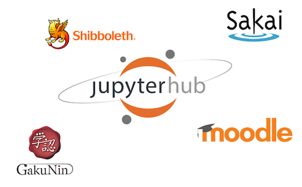
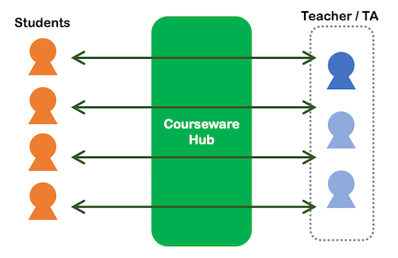
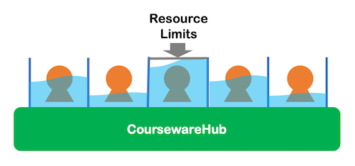

---
# Feel free to add content and custom Front Matter to this file.
# To modify the layout, see https://jekyllrb.com/docs/themes/#overriding-theme-defaults

title: CoursewareHubとは
layout: home
sidebar:
  nav: main
---

CoursewareHubとは、国立情報学研究所にて開発している **講義に特化した[JupyterHub](https://jupyter.org/hub)のディストリビューション** です。

# CoursewareHubの特徴

## 既存システムとの連携性

JupyterHubを利用する場合、ユーザ認証をどのように設定するかが大きな課題となります。
現在は大学の統合アカウントの他、GoogleアカウントやMicrosoftアカウントのような、パブリッククラウドのユーザアカウントを持つ場合も多いものの、
講義でJupyterHubを利用する場合は、その講義の履修者のみに利用可能にしたいといった要求もあります。

{: .align-center}

CoursewareHubではこのような特定のグループにのみ利用を許可するため、以下の機能を提供します。

- 学認クラウドゲートウェイによるグループ単位での許可
- LTIによるLMSコースメンバーのみの許可

CoursewareHubではこれらの設定を容易に行うことができ、面倒なユーザ許可を簡単に、適切に行うことができます。

## 強力なデータ集約・配信機能

Jupyter Notebookを講義に利用したい場合は Google Colab も選択肢となります。Google ColabはGoogleアカウントさえあれば利用可能な簡便性がある一方で、
ユーザ間のデータ共有はGoogle Driveの機能やLMS(Learning Management System)を利用する必要があり、
受講者自身がこれらのサービスを意識して利用する必要があります。

{: .align-center}

CoursewareHubではこのようなデータ集約を容易に行うことができます。

- 受講者の実行ログ・回答をリアルタイムに集約
- 講師から受講者に講義資料を配信

CoursewareHubでは外部サービスを利用することなくこれらのデータ集約・配信を行うことができます。Jupyter Notebookで動作する独自拡張・独自カーネルに
より、受講者のより詳細な振る舞いを収集、分析するようなLearning Analyticsの実践も可能です。

## 安定稼働のためのリソース制御

Jupyter NotebookはWebブラウザから簡単にプログラミングを試せる反面、Fork爆弾のような危険なコードを気楽に実行できてしまう問題があります。
リソース制限を適切に定義しないと、このようなコードの実行は受講者本人の環境だけでなく、JupyterHub全体に影響を及ぼしてしまいます。

{: .align-center}

CoursewareHubではこのようなリソース制御を容易に行うことができます。

- リソース制限テンプレートの初期設定・カスタマイズ情報の提供
- Jupyter Notebookのカーネルレベルでの制限

CoursewareHubはこのようなリソース制御のテンプレートを提供し、リソース制御の設定し忘れを防ぎます。
また、Jupyter Notebookで動作する独自開発したカーネルにより、カーネル最大数などより細やかな制限も可能です。

# CoursewareHubを利用する

CoursewareHubを利用するには以下のいずれかの方法でセットアップする必要があります。

## 学認クラウドオンデマンド構築サービスを使って構築する

[学認クラウドオンデマンド構築サービス アプリケーションテンプレート](https://github.com/nii-gakunin-cloud/ocs-templates)にある[講義演習環境テンプレート](https://github.com/nii-gakunin-cloud/ocs-templates/tree/master/CoursewareHub)を利用することでCoursewareHubを構築することができます。

利用には [学認クラウドオンデマンド構築サービス](https://cloud.gakunin.jp/ocs/) への接続申込みが必要です。

## オンプレミス環境に構築する

Amazon EC2インスタンスや、オンプレミス環境へのセットアップ手順は現在準備中です。
